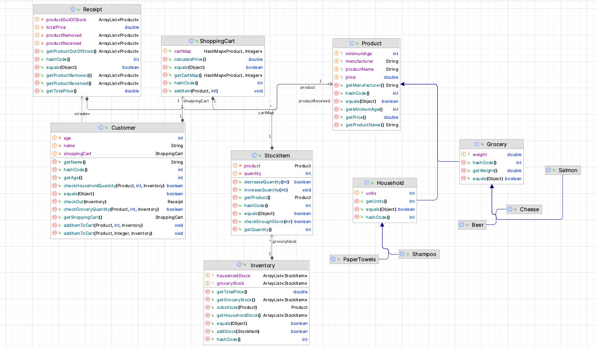

# Assignment 2

1. [UML Design](#uml-design)
2. [Problem 1 - Representing Products and Keeping Track of Stock](#problem-1---representing-products-and-keeping-track-of-stock)
3. [Problem 2 - Online Ordering for In-Store Pickup](#problem-2---online-ordering-for-in-store-pickup)

## UML Design

## Problem 1 - Representing Products and Keeping Track of Stock
- Represent various types of products (Grocery and Household) for sale in the store.
- Track specific products such as Salmon, Cheese, Beer, Paper towels, and Shampoo.
- Keep track of product information such as manufacturer, product name, price, and minimum age requirement.
- Implement stock management functionality to check item availability and reduce quantities upon purchase.
- Create an inventory to manage Grocery and Household stock items.
- Add new stock items and calculate the total retail value of all items in stock.

## Problem 2 - Online Ordering for In-Store Pickup
- Extend the system to support online ordering and in-store pickup.
- Introduce Customers with shopping carts containing a list of products.
- Enable customers to add products to their cart and calculate the total cost.
- Implement order fulfillment process including stock adjustments and product substitutions.
- Process orders by updating stock quantities, removing items not meeting age requirements, and generating receipts.
- Generate receipts summarizing the order details including total price, received products, out-of-stock items, and age-restricted items.
