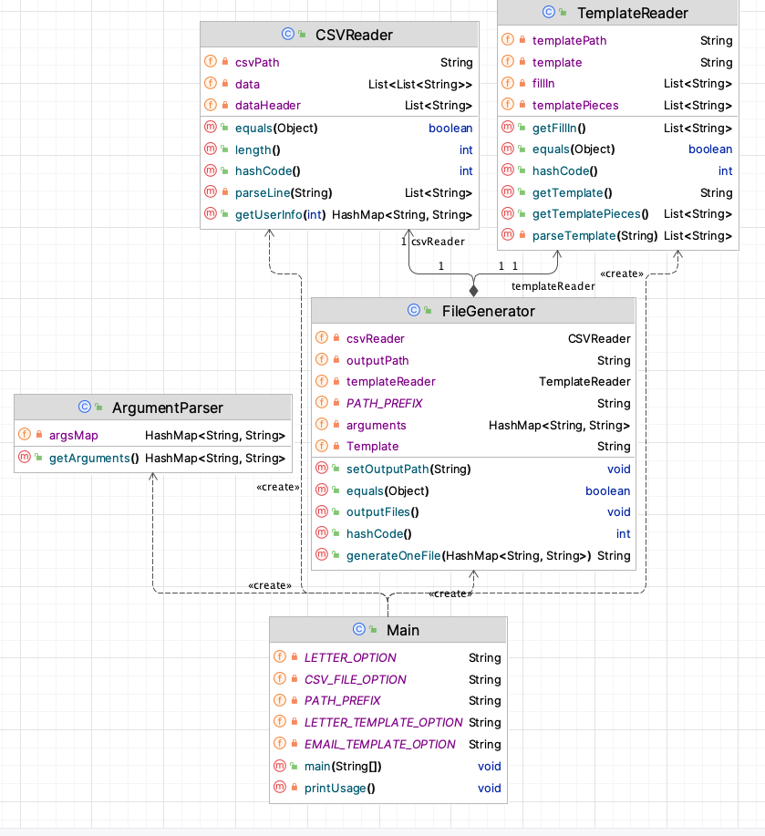

# Assignment 3

1. Introduction
2. Usage
3. Example Configuration
4. Note

## 1. Introduction
This project is designed to take a CSV file containing customer information and generate email or letter files based on provided templates.

## 2. Usage
To run this program, follow these steps:
- Open the main class and modify the configuration.
- Configure the following options:
  - --email or --letter: Specify whether to generate email or letter files.
  - --email-template <file>: Provide the path to the email template file.
  - --letter-template <file>: Provide the path to the letter template file.
  - --output-dir <path>: Specify the output directory where generated files will be saved.
  - --csv-file <path>: Specify the path to the CSV file containing customer information.

## 3. Example Configuration
An example configuration is shown below:
<code>
   --letter
   --letter-template
   src/main/resources/letter-template.txt
   --output-dir
   test_output/dr
   --csv-file
   src/main/resources/insurance-company-members.csv
</code>

This configuration will use the letter template from the specified path, take the CSV file from the specified path, and output the generated files to the specified directory.

## 4. Note
- Ensure to replace placeholders with actual file paths and filenames in the configuration.
- Verify that the paths provided are correct and accessible.
- The name of each generated file will be formatted as the first name + last name inside the specified output directory.

